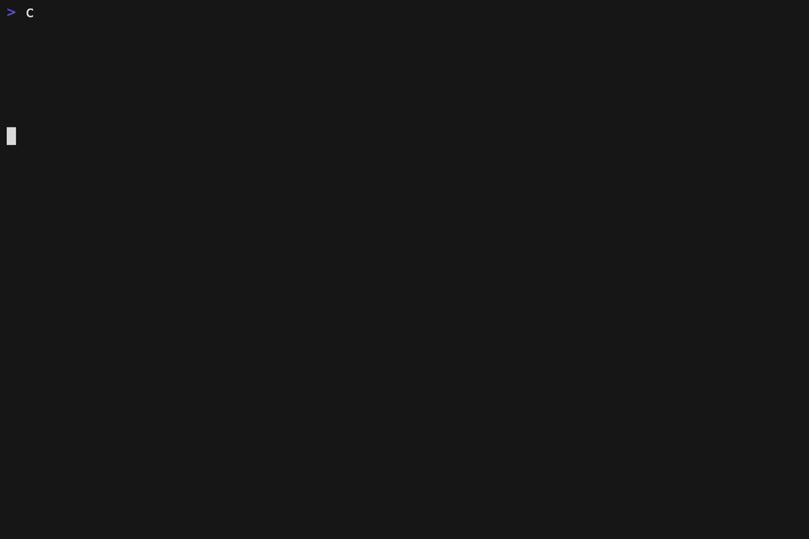

# Use Sidetree with BNB

## Prerequisites 

- BNB Smart Chain (Private key needed)
- Mongo DB
- Docker - Docker Compose

---
## Steps
1) Go to `packages/did-method-modena-api/configModena/bnb` and copy both files: 
- `modena-node-config.json`
- `wallet-provider-config.json`
	
    And paste them in `packages/did-method-modena-api/config`
    
2) Open `wallet-provider-config.json` and paste your BNB Smart Chain private key. It should look like this:
```json
{
    "privateKeys": [
    	"0x9c1534b4285d3ca01c2410b523NOT_A_REAL_KEY01234567890abcdef123456"
    ]
}
```
3) Go to the root directory and open `docker-compose-bnb.yml`. Make sure to do the following changes:
- `RPC_URL` with the RPC endpoint of the node
- `MONGO_DB_CONNECTION_STRING` with the url of the mongo database
- `WALLET_PRIVATE_KEY` with the private key of your BNB Smart Chain wallet


## Run

From a terminal located in the root directory of the project, run:
```sh
> docker-compose -f docker-compose-bnb.yml up
```
The result should look something like this.


## Test

To test sidetree, we will use send a request asking to create a new did. The request looks like this:


```bash
> curl --location --request POST 'http://localhost:6900/create' \
--header 'Content-Type: application/json' \
--data-raw '{
        "type": "create",
        "suffixData": {
          "deltaHash": "EiDWGXLaOtW-HvrJScEBztHNDxc93VNj1JBogpdIueZvkQ",
          "recoveryCommitment": ["EiBYmzZpKEwizwRkVreafiY6hQ5ryj7kOdOtYf1juzqaSg"]
        },
        "delta": {
          "updateCommitment": "EiDuUsgwLZUWfOMr8vr4WGhgJIFdRBzgsAagBgamT3AoCw",
          "patches": [
            {
              "action": "replace",
              "document": {
                "publicKeys": [
                  {
                    "id": "z6MketVRdtjtPknt1ffbbx7KXBjGL9ERHuJHKzy28yuymHQa",
                    "type": "JsonWebKey2020",
                    "publicKeyJwk": {
                      "kty": "OKP",
                      "crv": "Ed25519",
                      "x": "BnamLr9mV2goDx4gfFzaBCBXWy2Bpa64cNNhVMIe4vc"
                    },
                    "purposes": [
                      "authentication",
                      "assertionMethod",
                      "keyAgreement"
                    ]
                  }
                ],
                "services": [
                  {
                    "id": "example-service",
                    "type": "ExampleService",
                    "serviceEndpoint": "https://example.com"
                  }
                ]
              }
            }
          ]
        }
      }' | jq .didDocument.id
```
This will look like this 


We need to save what the request returned, that's our did.
Then we can resolve it to see if it was created. To do so, we need to copy the identifier piece of the did (everything after `did:modena:bnb:` and use paste it in the resolver endpoint.

```bash
curl --location --request GET 'http://localhost:6900/resolve/YOUR_DID_IDENTIFIER

```
It should return the did document associated with the identifier.



And that's. all. With these simple steps we can use BNB Smart Chain with sidetree!
